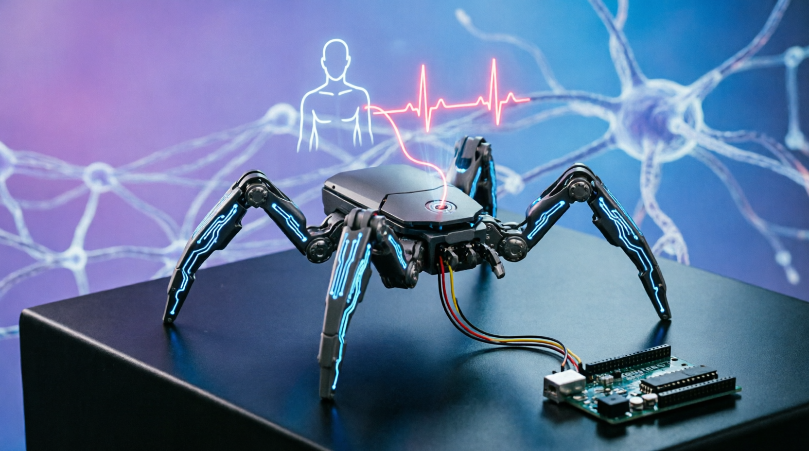
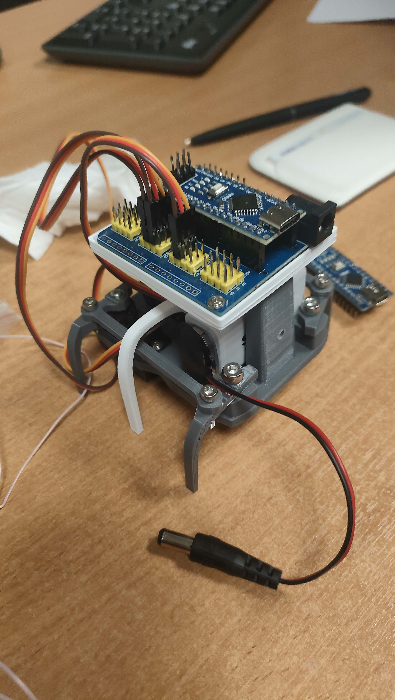

# 🕷️ Pulse Walker



**A biofeedback-controlled hexapod robot for neurocognitive training.**

Pulse Walker is a robotic system designed to help users train their autonomic nervous system (ANS) through biological feedback. The robot's locomotion speed is directly modulated by the pilot's physiological state—specifically **Heart Rate (HR)** and **Heart Rate Variability (RMSSD)**.

By controlling the robot's speed through self-regulation (e.g., breathing techniques), the user receives immediate visual and haptic feedback, facilitating the development of vagal tone control and stress resilience.

---

## 🧠 Concept & Workflow

The system operates on a closed biofeedback loop:

1.  **Input:** An ECG sensor captures the pilot's heart rhythm.
2.  **Processing:** An Arduino reads the signal and calculates real-time metrics (`HR`, `RMSSD`) and joystick position (`Vx`, `Vy`).
3.  **Bridge:** A Python GUI application receives this data stream, visualizes the ECG, and acts as a bridge to the robot controller.
4.  **Output:** The robot adjusts its servo oscillation frequency based on the incoming HR or RMSSD values.
    *   *High HR (Excitement)* → Faster movement.
    *   *High RMSSD (Calmness)* → Slower, smoother movement.

---

## 🛠️ Hardware Requirements

| Component | Description | Notes |
| :--- | :--- | :--- |
| **Microcontrollers** | 2x Arduino (Uno, Nano, or Mega) | One for ECG, one for Robot |
| **Hexapod Chassis** | 3-DOF | Modified for 3 servos |
|**Bluetooth module**| HC05(HC06)| conneted to RX\TX on robot controller|
| **Actuators** | 3x MG996R or SG90 Servos | Connected to pins 5, 6, 9 |
| **Sensors** | AD8232 or Bitronics ECG Module | Connected to A0 |
| **Input** | Analog Joystick Module | Connected to ecg Arduino Vx to A5, Vy to A6 |
| **Connectivity** | USB or Bluetooth Serial | Connects Robot Arduino to PC |

### Hexapod

---


## 📦 Software Architecture

The system consists of three main parts:

1.  **ECG Module:** Reads sensor data, filters noise (bandpass), and outputs text strings like: `SIG:500 HR:72.5 Vx:512 Vy:400 ...` (`Arduino/ECG_processor`).
2.  **Robot Controller:** Receives commands (`HR:xx`, `RMSSD:xx`, `U`, `L`, `R`, `S`) and drives the servos using a non-blocking state machine(`stl`, `Arduino/bio-robot-control`).
3.  **Python Bridge (`app.py`):** Parses the serial stream, updates the UI, and forwards movement/bio-feedback commands to the robot.

---

## 🚀 Installation & Setup

### 1. Python Dependencies
You will need Python 3.8+.

### 2. Arduino Flashing
Upload the **Robot Controller** sketch (e.g., `bio_robot_control.ino`) to the Arduino connected to your robot.
*   **Servo Pins:** 5 (Right), 6 (Center), 9 (Left).
*   **HC-05 Pins:** 5V(VCC), GND(GND), TX(RX), RX(TX).
*   **Serial Baud Rate:** 9600.

### 3. ECG Module
Upload the ECG processing sketch to your second Arduino. Ensure it is connected to the PC running the bridge software.

---

## 💻 Usage

### Running the GUI
1.  Connect both the ECG module and the Robot module to your computer.
2.  Run the application:
    ```bash
    python app.py
    ```
3.  **Select COM Ports:** Choose the correct ports for "ECG" and "Robot" from the dropdown menus.
4.  **Connect:** Click the `Connect` button.
5.  **Mode Selection:** Use the radio buttons to switch between **HR** (Heart Rate) and **RMSSD** (Variability) as the control parameter.

### Command Protocol
The robot accepts the following commands via Serial:
*   `HR:72.5` - Set frequency based on Heart Rate (60-120 BPM).
*   `RMSSD:45.2` - Set frequency based on RMSSD.
*   `U` - Forward / Active movement.
*   `L` - Turn Left.
*   `R` - Turn Right.
*   `S` - Stop / Reset.

---

## 📦 Building the Executable (PyInstaller)

This project can be compiled into a standalone `.exe` file using **PyInstaller**. This allows you to run the application without having Python installed on the target machine.

### Build Instructions

1.  **Project Structure:**
    Ensure these files are in your root directory:
    *   `app.py` (Main script)
    *   `build.bat` (Build script for Windows)
    *   `build.sh` (Build script for Windows)

2.  **Run the Build:** 
    Run `build.bat`(`build.sh`) from the terminal with conda(*prefer to create a new environment, because `matplotlib, pyserial, pyinstaller` will be installed in your environment*):
    ```cmd
    build.bat
    ```

4.  **Output:**
    If successful, the application will be created in the `dist` folder:
    `dist\pulse-walker\pulse-walker.exe`

   Script will automaticly create lnk-file in build-script folder.

### 🎨 Icon

<p align="center">
  
</p>   

---

##  Credits
*   **Concept:** Biofeedback Hexapod Control.
*   **Technology:** Arduino, Python, Tkinter, Serial Communication.
*   **License:** MIT License (or insert your license here).

---